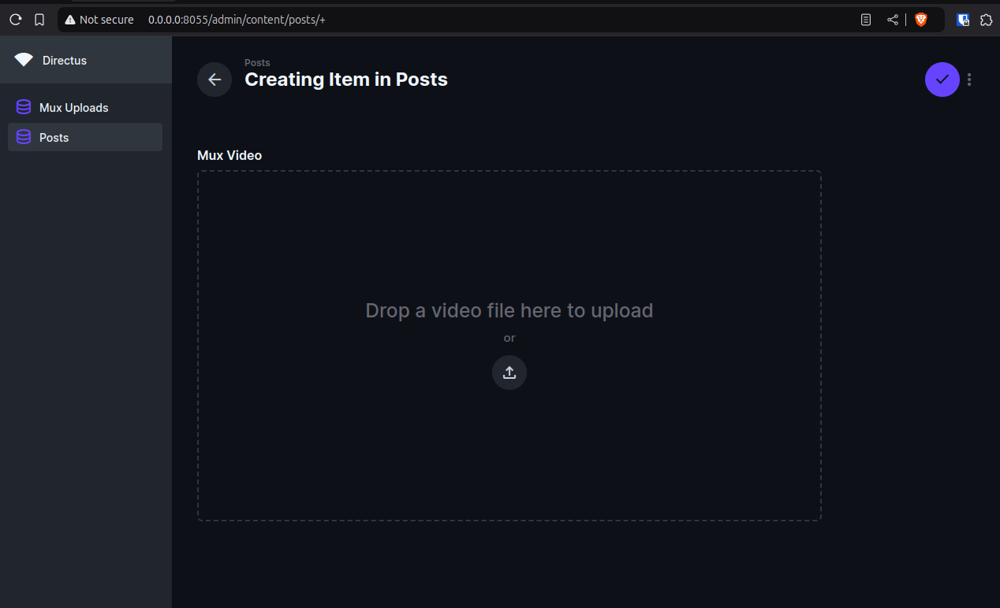
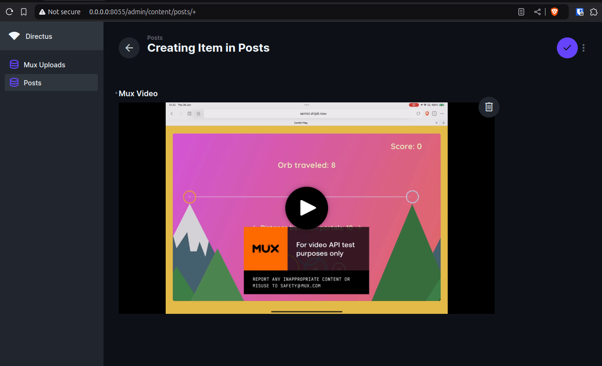

# Directus Extension for Mux

This extension provides an interface to upload videos directly to Mux and display them in the Directus app.

It utilizes Mux Upload and Mux Player components.

## Limitations:
- Only one video per field is supported.
- Only the **Public** playback policy is available for now.
- Uses the default video quality set in your Mux account.
- Requires a separately deployed webhook processor to handle upload success and error events. See: [directus_webhooker](https://github.com/gigor/directus_webhooker).

## Plans and todos:
- Video upload settings - public|signed, video quality etc.
- Custom view for mux upload collection
- Select video from previously uploaded
- Manage mux videos - delete videos from mux when deleted from directus collection

## Setup:

### Create a collection for `mux_uploads` in Directus with the following fields:
- `id` - ID
- `upload_id` - Text
- `upload_url` - Text
- `upload_url_expires_at` - Datetime
- `asset_id` - ID
- `playback_id` - ID
- `status` - Text

### Provide environment variables in your Docker Compose file or `.env` file:

```env
MUX_ACCESS_TOKEN="your_public_mux_access_token"
MUX_SECRET="your_secret_mux_secret"

# Modify the Content Security Policy (CSP) in your environment variables to allow displaying images and videos from Mux:
# The following includes Directus defaults and required settings for Mux.
CONTENT_SECURITY_POLICY_DIRECTIVES__IMG_SRC="'self' data: blob: https://raw.githubusercontent.com https://avatars.githubusercontent.com https://image.mux.com"
CONTENT_SECURITY_POLICY_DIRECTIVES__MEDIA_SRC="'self' blob: https://stream.mux.com https://image.mux.com https://*.fastly.mux.com https://storage.googleapis.com"
CONTENT_SECURITY_POLICY_DIRECTIVES__CONNECT_SRC="'self' https://api.mux.com https://stream.mux.com https://image.mux.com https://*.fastly.mux.com https://storage.googleapis.com"
```

### Deploy and set up the webhook processor

A separate webhook processor is required to handle upload success and error events from Mux. It's a separate service because I could not figure out how to verify webhook requests from Directus endpoints. Suggestions are welcome!

See: [directus_webhooker](https://github.com/gigor/directus_webhooker)

## Screenshots




